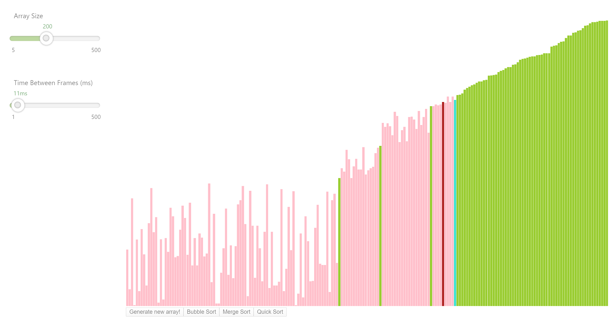

# Sort Visualizer

This project was created by Sumit Yadav using ReactJS in an effort to gain experience in developing a React App, while solidifying the concepts underlying some popular sorting algorithms.

## Sorting algorithms

1. Bubble Sort
2. Merge Sort
3. Quick Sort
4. Heap Sort (In development)

## How does it work?

Although the various sorting algorithms presented their own challenges, they all work with the same basic principle of taking 'snapshots' of every step/frame in the algorithm's sequence.

The algorithm records whenever two elements are being compared, swapped, when an element reaches its final position and some other such operations which vary with each algorithm.

### For example: Quick Sort

Quick sort works by choosing a Pivot element in the array, and moving all elements lesser than the pivot to its left (in an ascending sort), and all elements greater to its right.  It then recursively calls Quick sort onto the partitioned left and right arrays - until the entire array is sorted.

As we partition the array and choose a pivot index, we push a ["pivot", index, _ ] 
'frame' into the recorded sequence. Then as we compare two elements on either side of the pivot, we push a   ["compare", index1, index2] frame into the sequence. Then, if the algorithm decides that they need to be swapped, we push a ["swap", index1, index2] frame.

The algorithms recognize ahead of time when an element has reached its final position. In the case of quick sort - we know that by definition of the algorithm, when a pivot element finishes moving   respective elements to its left and right arrays - then the pivot has reached its final position in the sorted array. Thus we push a ["final", index1, _ ] frame to the sequence.

Our ArrayContainer gets this sequence from the various sort algorithms, and then displays the frames in order, with speed based on a defined FRAMERATE constant.  Thus creating an animation of the sort which just took place. 
All operations, such as compare, swap and final have their own unique colors to help identify the sorting sequence.

## Future goals

Since I had a lot of fun gradually adding features to this visualizer, I have a list of things I want to implement in the near future:

1. Add a color legend for the current sorting algorithm being performed.
2. Add a musical output where each index of the array corresponds to a different musical note, and each color/operation being performed on the array index modifies that note. The idea is that you should be able to 'hear' the array get sorted.
3. Add more sorting algorithms! Show the performance of an algorithm and allow a user to compare it to another algorithm with the same array.